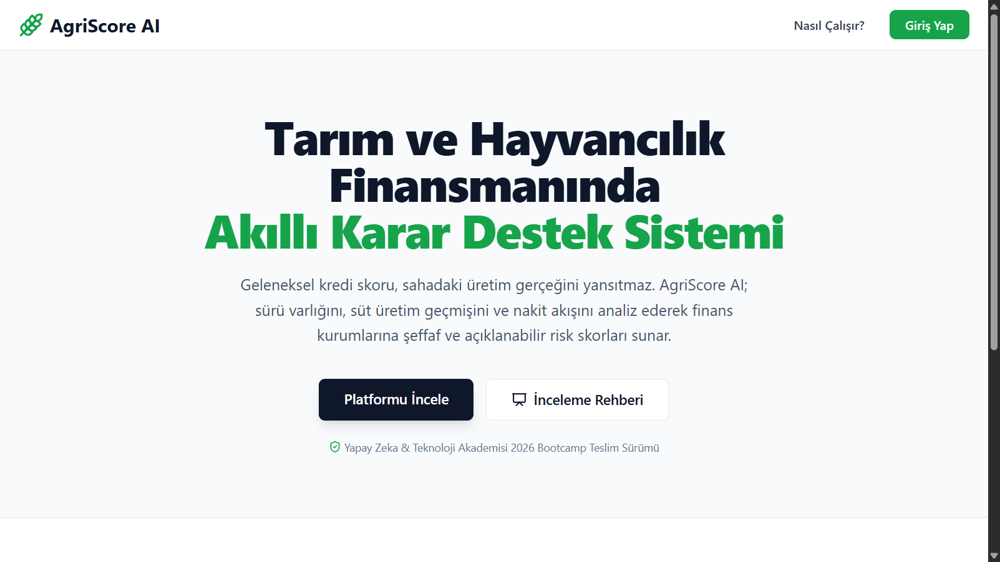
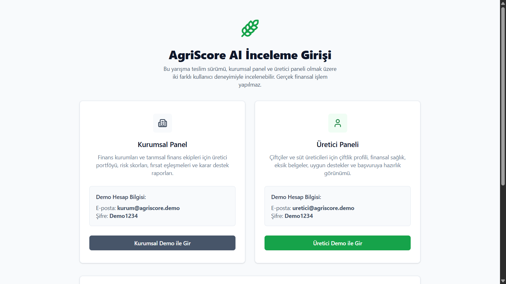

# YZTA Bootcamp 2026 - Sprint Süreci

## **Takım İsmi**

**AgriScoreFinTech** 

## **Takım Logosu**



## **Takım Elemanları**

|    | <div align="center">İsim</div>   | <div align="center">Rol</div>  | <div align="center">Sosyal Medya</div>     |
| :-----------: | :---------- | :---------- | :----------: |
|  👨🏻‍💻  | Sadık Gölpek     | Product Owner     | [](#)   | 
|  👩🏻‍💻  | Nihal Metin     | Scrum Master     |  [](#) |
|  👨🏻‍💻  | Gökhan Demir      | Developer      |  [](#)   |
|  👨🏻‍💻  | [İsim Soyisim]      | Developer     |    [](#)    |
|  👨🏻‍💻  | [İsim Soyisim]      | Developer     |    [](#)    |

## **Ürün İsmi**

**AgriScore AI**

## **Ürün Logosu**


## **Ürün Açıklaması**

- **AgriScore AI**, geleneksel finans sistemlerinin kırsaldaki süt ve hayvancılık üreticilerini değerlendirirken yaşadığı veri yetersizliği problemini çözer. Çiftliklerden gelen IoT veri akışlarını, geçmiş üretim dökümlerini ve sürü varlığını yapay zeka ile analiz ederek dinamik bir kredi skorlama modeli ve karar destek paneli sunar.

## **Ürün Özellikleri**

- **Gelecek Verim Tahmini:** Zaman serisi analizi ile işletmenin önümüzdeki aylardaki garantili süt hacmini ve nakit akışını tahmin etme.
- **AI Agent & Hafıza Yapısı:** Çiftliğin sağlık geçmişini, iklimsel ve dönemsel risk faktörlerini kalıcı hafızasında (vektör tabanlı) tutan ve bankacılar için otomatik risk raporu özetleyen LLM tabanlı asistan yapısı.
- **FinTech Paneli:** Bankaların ve finans kuruluşlarının mikro-kredilendirme süreçlerini otomatikleştiren şeffaf risk paneli.

## **Hedef Kitle**

- Tarım bankacılığı ve mikrokredi sağlayan finansal kuruluşlar.
- Sürdürülebilir finansmana erişmek ve üretimini büyütmek isteyen süt üreticileri / çiftçiler.

## **Product Backlog URL**

- [Miro / Trello / GitHub Projects Backlog Linki](#)

---

## **Sprint Güncellemeleri**
* **Sprint 1 Ürün Durumu (Ana Sayfa & Giriş Ekranı)**
  
  
  <br/>
  

* [Sprint 2 Notları & Ekran Görüntüleri](#)
* [Son Sprint Notları & Ekran Görüntüleri](#)

---

## 🚀 Kurulum ve Çalıştırma (Nasıl Çalışır?)
Bu proje, modern bir web arayüzü ve yapay zeka tabanlı analiz motorlarının entegre çalıştığı bir mimariye sahiptir.

### Gereksinimler
- Node.js (v18+) ve npm/yarn (Arayüz için)
- Python 3.9+ (Arka plan yapay zeka modelleri için)

### Adım Adım Kurulum
1. Projeyi bilgisayarınıza klonlayın:
   ```bash
   git clone https://github.com/sadikgolpekk/AgriScoreFinTech.git
   cd AgriScoreFinTech
   ```
2. Frontend bağımlılıklarını yükleyin:
   ```bash
   npm install
   ```
3. Geliştirme sunucusunu başlatın:
   ```bash
   npm run dev
   ```
4. Tarayıcınızda `http://localhost:5173` adresine giderek uygulamaya erişebilirsiniz.

---

## 📂 Proje Klasör Yapısı ve Dosya İşlevleri

Proje yapımız kurumsal standartlara ve ayrıştırılmış mimariye (Separation of Concerns) uygun olarak tasarlanmıştır:

- **`src/`** 👉 Uygulamanın ana kaynak kodları.
  - **`components/`** 👉 UI (Arayüz) ve Güvenlik bileşenleri. Örneğin `RoleGuard.tsx` yetkisiz erişimleri engeller.
  - **`pages/`** 👉 Uygulama sayfaları (Dashboard, Kurumsal Panel, Üretici Paneli vb.).
  - **`services/`** 👉 Yapay zeka motorları ve iş mantığı:
    - `aiAgentService.ts`: LLM tabanlı yapay zeka asistanını yönetir.
    - `forecastEngine.ts`: Geçmiş süt verilerine bakarak gelecekteki verimi tahmin eder.
    - `scoreEngine.ts`: Üretici için 0-1000 arası risk/kredi skoru üretir.
    - `opportunityEngine.ts`: Üreticinin skoruna uygun kredi kampanyalarını eşleştirir.
  - **`data/`** 👉 `seedData.ts` içerisinde uygulamanın demo (örnek) verileri yer alır.
  - **`auth/`** 👉 Demo giriş işlemleri ve oturum (session) yönetimi.
- **`docs/`** 👉 Projenin vizyonu, teknik mimarisi, pazar araştırması ve güvenlik belgeleri.
- **`requirements.txt`** 👉 Yapay zeka servislerinin (Score/Forecast Engine) Python kütüphane bağımlılıklarını listeler.
- **`package.json`** 👉 Uygulamanın (React/Vite) ihtiyaç duyduğu npm paketlerini yönetir.

---

## 🛠 Kullanılan Teknolojiler (Tech Stack)

* **Frontend:** React, TypeScript, Vite, Tailwind CSS, Recharts (Grafikler)
* **Backend & AI Engine (Kavramsal):** Python, FastAPI, Scikit-learn, Langchain, Prophet
* **Kod Kalitesi ve Güvenlik:** Oxlint, TypeScript Strict Mode, Role-Based Access Control (RBAC)

---
*Bu repo, Yapay Zeka ve Teknoloji Akademisi Bootcamp 2026 yarışma teslimi standartlarında hazırlanmıştır.*
