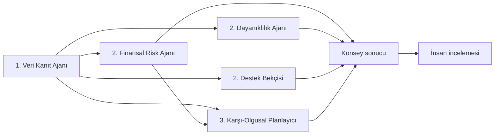

# AgriScore AI ve Kanıt Konseyi Mimarisi

## Tasarım kararı

AgriScore’da LLM karar motoru değildir. Kanonik hesaplar deterministik ve test edilebilir servislerde çalışır; LLM yalnızca bu sonuçları doğal dille açıklayan isteğe bağlı bir katmandır.

Bu ayrım üç nedenle zorunludur:

1. Aynı girdiye aynı karar destek sonucunu üretmek.
2. Eksik veride uydurma skor veya resmi uygunluk üretmemek.
3. Her sonucun yöntem, kanıt, sınırlama ve insan incelemesi sınırını göstermek.

## Kanıt Konseyi

Kaynak: `src/services/decisionCouncilEngine.ts`
Sürüm: `council-v1.0`

### Ajanlar

1. **Veri Kanıt Ajanı**
   - Doğrulanmış, bekleyen ve eksik kaynakları ayırır.
   - Birleşik veri güvenilirliğini kullanır.
   - Doğrulanmamış belgeyi olumlu kanıt saymaz.
2. **Finansal Risk Ajanı**
   - `rules-v2.0`, işletme geliri, mevcut DSCR ve güvenli yeni taksit aralığını açıklar.
   - Kredi onayı veya reddi üretmez.
3. **Dayanıklılık Ajanı**
   - Yem +%15, süt fiyatı -%10 ve üretim -%10 şoklarını gerçek girdilerden yeniden hesaplar.
   - DSCR 1,25 altındaki senaryoları uzman incelemesine taşır.
4. **Destek Bekçisi**
   - Yapılandırılmış fırsat kurallarını ve eksik belgeleri değerlendirir.
   - Sentetik programı resmi güncel uygunluk olarak sunmaz.
5. **Karşı-Olgusal Planlayıcı**
   - Belge doğrulama, yem/diğer gider verimliliği ve kurum onayına bağlı borç azaltma kombinasyonlarını sınırlandırılmış uzayda arar.
   - Kimlik, konum, işletme türü ve sürü varlığı gibi değiştirilemez alanları değiştirmez.
   - Hedef banda ulaşan en düşük maliyetli doğrulanabilir kombinasyonu sıralar.

### Orkestrasyon

Konsey;

- ajan durumlarını,
- görüş ayrılıklarını,
- ortak inceleme önceliğini,
- karşı-olgusal eylem yolunu,
- insan incelemesi gereksinimini

tek bir typed sonuçta birleştirir. Ajanlar çeliştiğinde bu çelişki gizlenmez.

## Karar makbuzu ve sınırlı hafıza

Kaynak: `src/services/decisionMemory.ts`
Şema: `1`
Anahtar: `agriscore.decision-memory.v1`

Karar makbuzu şu özet alanları taşır:

- üretici senaryo ID ve adı,
- oluşturma zamanı,
- kanonik girdinin SHA-256 parmak izi,
- `rules-v2.0` ve `council-v1.0` sürümleri,
- skor/risk/güvenilirlik,
- inceleme önceliği ve insan kapısı,
- görüş ayrılığı ve karşı-olgusal eylem sayısı.

Yalnızca son beş kayıt tarayıcı `localStorage` alanında tutulur. Ham PDF, finans hareketi, serbest metin veya LLM konuşması hafızaya yazılmaz. Bu mekanizma üretim audit log’u değildir; yarışma demosunda sürümlü ve kullanıcı kontrollü karar sürekliliğini gösterir.

## Co-Pilot çalışma modları

### Canlı LLM modu

- Endpoint: `POST /api/copilot/chat`
- Sağlayıcı: ortamda `GROQ_API_KEY` varsa Groq
- Varsayılan model: `llama-3.1-8b-instant`
- Sıcaklık: `0.1`
- Yanıt modu: `live_llm`

Backend; isim, belge açıklaması ve doğrulama notu gibi gereksiz alanları sağlayıcı bağlamına göndermez. Bağlam profil ID, işletme tipi, il, toplu sürü/finans alanları ve sınırlı risk notlarıyla minimize edilir.

### Yerel deterministik mod

Sağlayıcı yoksa veya hata verirse `src/services/localCopilot.ts`, aynı skor ve Kanıt Konseyi sonuçlarını açıklar.

- Sabit üretici skoru yoktur.
- Bağlam yoksa `DATA_UNAVAILABLE` döner.
- Yanıt “Yerel deterministik analiz” olarak etiketlenir.
- Canlı sağlayıcı başarısı ürünün çekirdek akışını bloke etmez.

## Güvenlik ve doğruluk sınırları

- Skor gerçek temerrüt etiketiyle kalibre edilmiş ML tahmini değildir.
- Canlı LLM yanıtı gerçek kullanıcı verisiyle doğruluk değerlendirmesinden geçmemiştir.
- Demo auth server-side değildir.
- Rate limit ve kalıcı sunucu audit log’u yoktur.
- Sağlayıcı DPA/veri lokasyonu üretim öncesi değerlendirilmelidir.
- Karşı-olgusal sonuç varsayımsal senaryodur; gerçekleşmiş eylem veya kredi tavsiyesi değildir.

## Test edilen sözleşmeler

- Aynı girdi aynı beş ajan sonucunu üretir.
- Düşük güvenilirlik insan incelemesini zorunlu kılar.
- Karşı-olgusal arama kaynak profili değiştirmez.
- Güçlü profil için gereksiz müdahale üretmez.
- Parmak izi 64 karakter SHA-256’dır.
- Hafıza yalnızca en yeni beş özeti tutar.
